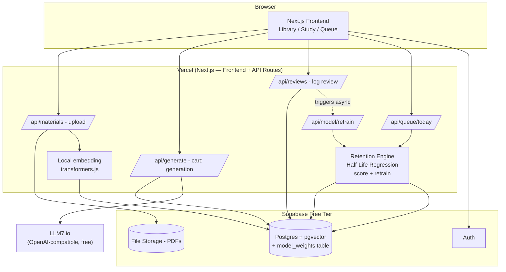
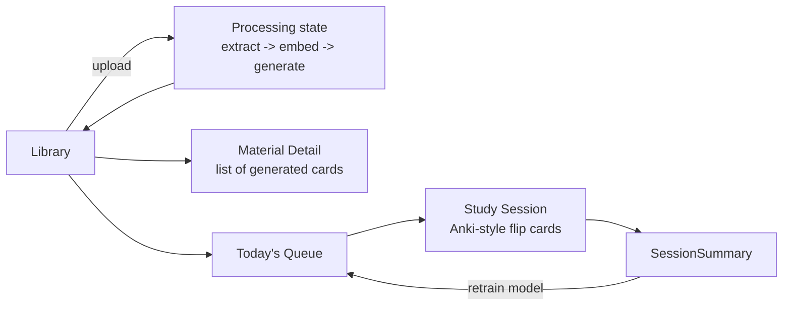
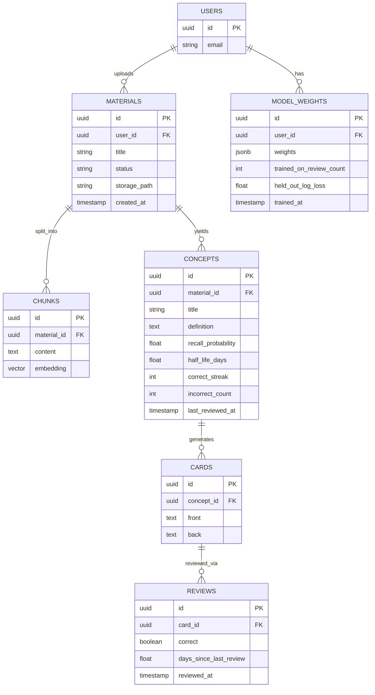
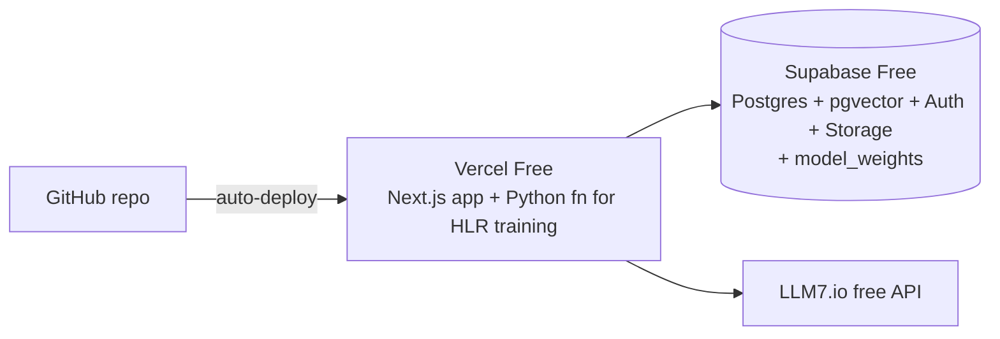

# Recall Engine — Free-Stack MVP Architecture (Showcase Build)

Got it — this version throws out anything that costs money or adds ops overhead, and narrows down to **one thing done really well**: upload material → auto-generate cards → study in a clean, Anki-like web UI → get a smart "what to review today" queue driven by a **real, trained retention model** — not a canned formula. Everything below is buildable with $0/month.

---

## 1. The Free Stack (Zero-Cost, No Credit Card)

| Layer | Choice | Why |
|---|---|---|
| **Frontend + Backend** | **Next.js (App Router)** — one monolith, deployed on **Vercel Free** | No separate frontend/backend deploy, no Celery/Redis infra needed for a showcase project. API routes = your backend. |
| **Database** | **Supabase Free Tier** (Postgres + `pgvector` + Auth + Storage, all in one) | Free tier gives you Postgres with pgvector already enabled, built-in auth (so you skip writing your own), and file storage for uploaded PDFs — three services for the price of one signup. |
| **LLM (generation)** | **LLM7.io** — OpenAI-compatible free endpoint | `base_url: https://api.llm7.io/v1`. Works with the standard `openai` SDK. Get a free token at `dash.llm7.io` — anonymous use is rate-limited (~30 RPM), a free registered token bumps you to ~120 RPM. No credit card, no billing. |
| **Embeddings** | **transformers.js (Xenova/all-MiniLM-L6-v2)** running locally in your Node backend | Zero API calls, zero rate limits, zero cost — the embedding model runs directly inside your Vercel function / Node process. |
| **Retention model (the novelty)** | **Half-Life Regression (HLR)** — a small trained log-linear model, `scikit-learn` (Python) or a hand-rolled JS gradient step | This is what makes the queue actually "learn" the user's forgetting curve instead of guessing with a fixed formula. Trains in milliseconds on a laptop, no GPU, no hosted ML service. |
| **PDF text extraction** | `pdf-parse` (npm) | Free, local, no API. |
| **Hosting** | **Vercel Free tier** | Generous free tier for hobby/showcase projects, auto HTTPS, zero-config deploys from GitHub. |

**Total monthly cost: $0.** No Redis, no Celery, no background workers, no paid DB, no paid inference, no paid ML training compute.

> ⚠️ Worth knowing for a showcase project: LLM7.io is an independent, unofficial free gateway (not run by OpenAI/Anthropic/etc.) — great for a portfolio MVP, but not something you'd rely on for a real product's uptime guarantees. Keep your LLM calls behind a single thin wrapper function (see §5) so swapping to Groq's free tier or Google's Gemini free tier later is a one-line change, not a rewrite.

---

## 2. What "MVP, Core Functionality Working Perfectly" Means Here

Not a business, a showcase. The bar isn't "handles every file format" — it's **the core loop has zero rough edges**, and the retention model is the piece that has to actually be *correct*, not just present:

1. Upload a PDF or paste text → clean extraction, no crashes on weird PDFs.
2. Card generation → flashcards that are actually good (accurate, concise, not hallucinated).
3. Study UI → feels genuinely good to use, keyboard-driven, fast, satisfying.
4. Queue → visibly, provably prioritizes what you're forgetting, ranked by a model **trained on the user's own review history**, with per-card model parameters, not a global constant — this is the "wow, that's a real ML system" moment for anyone looking at your portfolio.

Everything else (PPT/DOCX/audio/OCR, MCQs, fill-in-blank, analytics dashboards) is v2.

### MVP Feature Cut

| Include | Cut for now |
|---|---|
| PDF upload + paste-text input | PPT, DOCX, audio, OCR, URL scraping |
| Flashcards (front/back) only | MCQs, fill-in-the-blank, auto-summaries |
| Correct / Incorrect review capture | Response-time tracking, session analytics |
| **Trained Half-Life Regression retention model** | Deep-learning / transformer-based forgetting models |
| Today's Queue (ranked list) | Exam-date weighting, subject filters |
| Single-user auth (Supabase Auth) | Teams, sharing, collaborative decks |

---

## 3. Simplified System Architecture



No Celery, no Redis, no background worker service, no hosted ML training infra. Card generation happens synchronously on upload. Model retraining is a **cheap, synchronous, in-process recompute** (see §6) — the whole model is small enough that "retrain" means "re-run a closed-form / a few gradient steps over one user's review rows," which finishes in well under a second even in a serverless function.

---

## 4. Anki-Like Study UI — Design Spec

This is the part that needs to feel *right*, since it's the centerpiece of the showcase alongside the retention engine. Here's the spec:

### Study Session Screen

- **Full-bleed card in the center**, generous whitespace, no clutter — just the question.
- **Space bar (or tap)** flips the card to reveal the answer.
- **After flip, two large buttons**: `Incorrect (1)` and `Correct (2)` — with number-key shortcuts so a whole session can be done without touching the mouse.
- **Thin progress bar** at the top: "Card 4 of 18" — visible but unobtrusive.
- **Subtle flip animation** (CSS 3D transform, ~200ms) — this single detail does a lot for "feels polished."
- **Dark mode by default** (or auto based on system preference).
- **No modals, no popups mid-session** — anything that breaks flow kills the "Anki feel."
- **End-of-session summary**: X reviewed, Y correct, small congratulatory state, direct link back to Today's Queue. This is also where the retention model silently retrains (see §6.5).

### Today's Queue Screen

- Ranked list, most-at-risk concept first, ordered by the **model's predicted recall probability**, not a static rule.
- Each row shows: concept title, recall-probability badge (e.g. "58% likely to recall"), last-reviewed date, and — this is the detail that sells the ML story in a demo — a small **"why"** affordance (see §6.6) showing the model's current half-life estimate and which features drove it.
- One big "Start Session" button that pulls the whole queue into the Study Session screen in ranked order.
- This screen is where the novelty of the whole project is *visually* obvious — make the recall-probability badge prominent, color-coded (red = at risk, green = solid).

### Library Screen

- Simple card grid, one per uploaded material, with a status pill (`Processing…` / `Ready`) and a card count.
- Upload button opens a dropzone modal (PDF or paste-text tab).



**Keyboard shortcuts:**

| Key | Action |
|---|---|
| `Space` / `Enter` | Flip card |
| `1` | Mark Incorrect |
| `2` | Mark Correct |
| `Esc` | Exit session |

---

## 5. LLM7 Integration Details

```ts
// lib/llm.ts — single wrapper, swap provider here later if needed
import OpenAI from "openai";

const llm = new OpenAI({
  baseURL: "https://api.llm7.io/v1",
  apiKey: process.env.LLM7_API_KEY, // free token from dash.llm7.io
});

export async function generateFlashcards(chunkText: string) {
  const response = await llm.chat.completions.create({
    model: "gpt-4o-mini-2024-07-18", // check dash.llm7.io for current free model list
    messages: [
      {
        role: "system",
        content:
          "You are a study assistant. Extract 3-6 key concepts from the given text and return ONLY valid JSON: an array of {concept, definition, flashcard_front, flashcard_back}. No markdown, no commentary.",
      },
      { role: "user", content: chunkText },
    ],
    temperature: 0.3,
  });
  return JSON.parse(response.choices[0].message.content!);
}
```

**Practical notes for a free/rate-limited API:**
- **Register a free token** at `dash.llm7.io` — anonymous requests are more heavily throttled.
- **Batch chunk-by-chunk with a small delay** between calls (1–2s) rather than firing all chunks in parallel.
- **Retry with backoff** on 429s (2–3 retries, exponential backoff).
- **Cache aggressively**: never regenerate cards for a chunk that's already been processed.
- **Always validate the JSON** the model returns before writing to DB.
- **Have a documented fallback** in your README (Groq / Gemini free tier, same OpenAI-compatible interface).

---

## 6. Retention Engine — The Core Novelty (ML-Based Half-Life Regression)

This is the part of the project that's actually worth talking through in an interview, so it gets the most detail. The goal: for every (user, card) pair, predict **p(recall)** — the probability the user still remembers that card *right now* — and use that to rank the queue. The model has to (a) start reasonable on day one with almost no data, and (b) get measurably more personalized as review history accumulates, and it has to do both **without any paid infrastructure**.

### 6.1 Why Half-Life Regression (HLR), specifically

Half-Life Regression is the approach Duolingo published and used in production for exactly this problem (spaced-repetition forgetting curves). It's a good fit for a free-stack showcase because:

- It's a **generalized linear model** (log-linear regression), not a deep net — trains on CPU in milliseconds on thousands of rows, no GPU, no hosted training service, `scikit-learn` or even plain NumPy/JS is enough.
- It's **interpretable by construction** — every feature has a learned weight you can show in a demo ("this card's half-life shrank because `incorrect_count` went up").
- It has a **closed mathematical form** connecting the thing you can directly measure (was the review correct) to the thing you actually want (how fast does memory decay), so you're not hand-waving a heuristic — the formula in the old MVP write-up (`half_life = base * (1 + 0.5*streak) / (1 + 0.3*wrong)`) was a hand-tuned approximation *of* this model family. HLR replaces the hand-tuned constants (`0.5`, `0.3`) with **learned weights fit to real data**.
- It degrades gracefully: with zero training data it falls back to sane priors; with a handful of reviews it already personalizes.

### 6.2 The Model

**Forgetting curve (fixed, from memory research — not learned):**

```
p_recall = 2 ^ ( -Δt / h )
```

where `Δt` = days since the card was last reviewed, and `h` = half-life in days (how long until recall probability drops to 50%).

**What's learned: `h` itself, as a log-linear function of features:**

```
h = exp( w · x )
```

- `w` is the weight vector — the thing the model actually trains.
- `x` is a feature vector built from the card's review history and the material's metadata.

**Feature vector `x` per (user, card) pair:**

| Feature | Description |
|---|---|
| `bias` | constant 1.0 (intercept) |
| `correct_streak` | consecutive correct reviews |
| `incorrect_count` | total incorrect reviews ever |
| `total_reviews` | log(1 + total review count) |
| `avg_days_between_reviews` | rolling average interval the user has actually used |
| `days_since_last_review` | recency signal, separate from the Δt used in the recall formula itself |
| `concept_embedding_similarity` | how close this card's embedding is to concepts the user has already mastered (pulled from `pgvector`) — a personalization signal that plain heuristic formulas can't express at all |
| `card_difficulty_prior` | optional: average incorrect-rate across *all* users for this generated card (cold-start signal, only meaningful once you have more than one user; safe to hardcode to 0 for a single-user demo) |

**Training objective:** minimize squared error between predicted and *observed* half-life, where the observed half-life for a completed review is back-solved from the actual outcome:

```
observed_h = -Δt / log2(p_observed)
```

with `p_observed` = 0.95 if the review was marked correct, 0.05 if incorrect (standard HLR trick — you never observe a continuous recall probability directly, so you clamp near 1 or near 0 depending on outcome and let the regression smooth it out across many reviews).

Loss (what `scikit-learn`'s `SGDRegressor` or a manual gradient step minimizes), in the log-half-life space for numerical stability:

```
L(w) = Σ ( w·x_i − log(observed_h_i) )²  +  λ‖w‖²
```

The `λ‖w‖²` term (L2 regularization) matters more than it looks like it should here — with only a handful of reviews per card early on, an unregularized fit will happily overfit to 2–3 data points and produce wild half-life swings. Regularization is what keeps early-stage predictions sane.

### 6.3 Reference Implementation

```python
# ml/train_hlr.py — run offline or as a lightweight serverless function
import numpy as np
from sklearn.linear_model import Ridge

FEATURE_NAMES = [
    "bias", "correct_streak", "incorrect_count", "log_total_reviews",
    "avg_days_between_reviews", "days_since_last_review",
    "concept_embedding_similarity",
]

def build_features(review_row) -> np.ndarray:
    return np.array([
        1.0,
        review_row["correct_streak"],
        review_row["incorrect_count"],
        np.log1p(review_row["total_reviews"]),
        review_row["avg_days_between_reviews"],
        review_row["days_since_last_review"],
        review_row["concept_embedding_similarity"],
    ])

def observed_half_life(delta_t_days: float, was_correct: bool) -> float:
    p = 0.95 if was_correct else 0.05
    return max(delta_t_days / -np.log2(p), 0.5)  # floor at 0.5 days

def train(review_rows) -> np.ndarray:
    X = np.stack([build_features(r) for r in review_rows])
    y = np.log(np.array([
        observed_half_life(r["delta_t_days"], r["was_correct"])
        for r in review_rows
    ]))
    model = Ridge(alpha=1.0)  # alpha = λ, the regularization strength
    model.fit(X, y)
    return model.coef_

def predict_half_life(weights: np.ndarray, features: np.ndarray) -> float:
    return float(np.exp(weights @ features))

def predict_recall(half_life_days: float, days_since_review: float) -> float:
    return 2 ** (-days_since_review / half_life_days)
```

```ts
// lib/retention.ts — TS mirror used at request time inside the Next.js API route
// (weights are trained by ml/train_hlr.py or a JS-native fallback — see 6.4 — and
// stored per-user in Postgres; this file only does inference, which is a dot product)

type Weights = number[]; // same order as FEATURE_NAMES

export function predictHalfLife(weights: Weights, features: number[]): number {
  const dot = weights.reduce((sum, w, i) => sum + w * features[i], 0);
  return Math.exp(dot);
}

export function predictRecall(halfLifeDays: number, daysSinceReview: number): number {
  return Math.pow(2, -daysSinceReview / halfLifeDays);
}
```

### 6.4 Zero-Cost Training Path (two options, pick based on how "showcase-ML" you want it to look)

**Option A — Python training script, weights persisted to Postgres (recommended for the portfolio story):**
Run `ml/train_hlr.py` as a small serverless function (Vercel supports Python functions) or a one-off script triggered via `/api/model/retrain`. It reads recent `reviews` rows for the user, fits `Ridge` (closed-form, no iterative training loop needed — this is the advantage of keeping the model linear), and writes the resulting weight vector to a `model_weights` row. Costs nothing, finishes in milliseconds even for thousands of reviews.

**Option B — Pure JS, no Python at all (simplest ops, still legitimate ML):**
Implement ridge regression's closed-form normal-equation solution directly in TypeScript using a small matrix library (or `mathjs`, already in your stack). For the feature/row counts a single-user demo will realistically have (tens to low thousands), this is fast and avoids a second runtime entirely.

```ts
// closed-form ridge regression: w = (XᵀX + λI)⁻¹ Xᵀy
import { matrix, multiply, inv, identity, transpose, add } from "mathjs";

export function fitRidge(X: number[][], y: number[], lambda = 1.0): number[] {
  const Xm = matrix(X);
  const Xt = transpose(Xm);
  const XtX = multiply(Xt, Xm);
  const reg = multiply(lambda, identity(X[0].length));
  const w = multiply(inv(add(XtX, reg)), multiply(Xt, matrix(y)));
  return w.toArray() as number[];
}
```

Either option keeps the *entire* ML system — features, training, storage, inference — inside the free stack from §1. No SageMaker, no hosted training job, no GPU rental.

### 6.5 When Retraining Happens

- **Not on every single review** (too chatty, no benefit — one review barely moves a regularized fit).
- **Trigger: end of each study session** (from `SessionSummary`, §4) — refit the user's weight vector over their full review history so far. At MVP scale (one demo user, a few hundred reviews) this is a sub-second operation; there's no need for a queue or cron job.
- **Cold start:** for a user with fewer than ~10 reviews total, skip training and use a fixed prior weight vector (reasonable defaults: small positive weight on `correct_streak`, small negative on `incorrect_count`, zero elsewhere) so the queue still ranks sensibly on day one. This prior is exactly the old hand-tuned heuristic formula, repurposed as the model's cold-start initialization — a clean narrative for a demo ("the heuristic didn't go away, it became the model's prior").

### 6.6 Making the ML Visible in the UI (this is what sells it in a demo)

- Store the current weight vector per user in `model_weights` (see schema, §7) and expose the top 2–3 contributing features per card via a `/api/queue/today` response field.
- In the Queue screen's "why" tooltip (§4), render something like: *"Half-life: 3.2 days — driven mostly by your 4-review correct streak, offset by 1 recent miss."* That sentence is a direct, honest readout of `w·x`, not a canned explanation — because the model is linear, this is trivial to generate (just show the top-magnitude `w_i * x_i` terms).
- Optionally chart recall-probability-over-time for a single card on its detail page (a simple SVG/line chart plotting `2^(-Δt/h)` as Δt increases) — a strong, cheap visual for a portfolio README or demo video.

### 6.7 Evaluation (so you can honestly claim the model "works")

Even for a single-user demo, hold out the most recent ~15% of reviews chronologically, train on the rest, and report:

- **Log-loss** of predicted `p_recall` against actual correct/incorrect outcomes on the held-out reviews.
- Compare against the naive baseline (the fixed heuristic formula) on the same held-out set — the concrete, honest claim to put in your README is *"the trained model reduces log-loss by X% over the fixed heuristic on held-out reviews,"* which is a real, defensible evaluation result rather than a vibes-based "it feels smarter."

### 6.8 This Is Still an Upgrade Path, Not a Dead End

Once you have more review volume (multi-user, more history), the same schema and API surface support swapping `Ridge` for a gradient-boosted model (LightGBM) or adding item-response-theory-style per-card difficulty parameters, without touching `/api/queue/today`'s contract — it always returns a ranked list with a `recall_probability`. That's the "v1 shipped an interpretable trained model, v2 story is already scoped" narrative for an interview.

---

## 7. Simplified Database Schema



`model_weights` is the one new table versus the original heuristic-only design — it stores the current learned coefficient vector per user (plus a lightweight training/eval audit trail: how many reviews it was trained on, and its held-out log-loss, straight from §6.7). `concepts.half_life_days` and `recall_probability` are now **written by the retention engine's inference step**, not computed inline by a fixed SQL-friendly formula — read-time computation still works the same way for `/api/queue/today`, it just calls `predictRecall(predictHalfLife(weights, features), daysSinceReview)` instead of the old constant formula.

---

## 8. Folder Structure (Next.js Monolith)

```
recall-engine/
├── app/
│   ├── (auth)/
│   │   ├── login/page.tsx
│   │   └── signup/page.tsx
│   ├── library/page.tsx
│   ├── library/[materialId]/page.tsx
│   ├── study/page.tsx              # Anki-style session, takes queue via query/state
│   ├── queue/page.tsx              # Today's Queue, shows recall-probability + "why"
│   └── api/
│       ├── materials/route.ts      # upload + list
│       ├── materials/[id]/route.ts
│       ├── generate/route.ts       # extract -> chunk -> embed -> LLM7 generate
│       ├── reviews/route.ts        # POST correct/incorrect, triggers retrain
│       ├── queue/today/route.ts    # ranked concepts (calls retention engine)
│       └── model/retrain/route.ts  # refits HLR weights for a user
│
├── components/
│   ├── FlashcardView.tsx           # flip animation, keyboard shortcuts
│   ├── QueueList.tsx               # recall badge + "why this card" tooltip
│   ├── UploadDropzone.tsx
│   └── SessionSummary.tsx
│
├── lib/
│   ├── llm.ts                      # LLM7 wrapper (§5)
│   ├── embeddings.ts               # transformers.js wrapper
│   ├── retention.ts                # HLR inference: predictHalfLife / predictRecall (§6.3)
│   ├── supabase.ts                 # client + server helpers
│   └── pdf.ts                      # pdf-parse wrapper
│
├── ml/
│   ├── train_hlr.py                # Ridge regression training (§6.3, Option A)
│   ├── features.py                 # feature-vector construction, shared w/ retention.ts logic
│   └── eval.py                     # held-out log-loss vs. heuristic baseline (§6.7)
│
├── supabase/
│   └── migrations/                 # SQL migrations (pgvector setup, tables incl. model_weights)
│
└── README.md                       # include the log-loss evaluation result here (§6.7)
```

---

## 9. Deployment Plan (All Free)



**Steps:**
1. Push repo to GitHub, connect to Vercel — auto-deploys on every push, free custom subdomain (`recall-engine.vercel.app`).
2. Create a Supabase project (free tier), enable the `vector` extension, run migrations (including `model_weights`).
3. Get an LLM7 token from `dash.llm7.io`, add as `LLM7_API_KEY` in Vercel env vars.
4. Add Supabase URL/keys as env vars in Vercel.
5. If using Option A (Python training function), confirm Vercel's Python runtime support for your plan; otherwise use the pure-JS ridge regression (Option B, §6.4) and skip this entirely.
6. Done — no servers to manage, no Docker, no CI beyond what Vercel/GitHub already give you for free, no hosted training infra.

---

## 10. Two-Week Build Order

| Days | Focus |
|---|---|
| 1–2 | Next.js scaffold, Supabase project + schema (incl. `model_weights`) + auth wired up |
| 3–4 | PDF/paste upload → `pdf-parse` extraction → chunking → local embeddings → store in pgvector |
| 5–6 | LLM7 wrapper + concept/flashcard generation prompt, tested + validated |
| 7–9 | **Study Session UI** — flip animation, keyboard shortcuts, dark mode, feel |
| 10–11 | Review logging + **Retention Engine**: feature construction, HLR training (§6.3), `/api/model/retrain`, `/api/queue/today` wired to model inference instead of a static formula |
| 12–13 | **Today's Queue UI** with recall-probability badge + "why this card" model-explanation tooltip (§6.6) — this is your "wow" moment |
| 14 | Held-out evaluation (§6.7) written up in README, polish pass, seed a demo deck, record a short demo clip |

---

## 11. Why This Still Reads as Novel (Even as a Free Portfolio Project)

Reviewers of a portfolio project aren't grading you on infrastructure spend — they're grading you on **whether you understood the interesting problem**. The interesting problem here was never "call an LLM to make flashcards" (that's a weekend Streamlit app). It's:

1. You built a real ingestion → embedding → generation pipeline (RAG), not just a single prompt call.
2. You built a **real, trained retention model** (Half-Life Regression) — not a hardcoded formula — with a defined feature set, a training procedure, a cold-start fallback, and a held-out evaluation against a naive baseline. That's the actual novelty, and it's defensible in an interview because you can explain the math, not just the API call.
3. You correctly scoped it: a linear model trained with closed-form ridge regression is the *right* amount of ML for the data volume a single-user demo actually has — reaching for a deep model here would be over-engineering, and choosing not to is itself a mature engineering judgment call.
4. The UI actually reflects the model's reasoning — the queue *shows* its work (recall probability, contributing features, last reviewed) rather than being a black box.

That combination — RAG + a genuinely trained, evaluated, explainable retention model + a UI that surfaces it — is what separates this from "yet another flashcard generator," even at zero budget.

---

## 12. If You Want to Extend After the MVP (Optional, Still Free-Friendly)

- Swap `Ridge` for `LightGBM`/gradient-boosted trees once you have enough multi-user review volume for a nonlinear model to actually help (more data than a single demo user will realistically generate).
- Add item-response-theory-style per-card global difficulty parameters, learned jointly across users (still free — fits in the same offline training script).
- Add MCQs and fill-in-the-blank using the same LLM7 wrapper with a different prompt.
- Multi-format ingestion (DOCX via `mammoth`, PPT via `pptx-parser`) — same pattern as PDF, additive, not a redesign.
